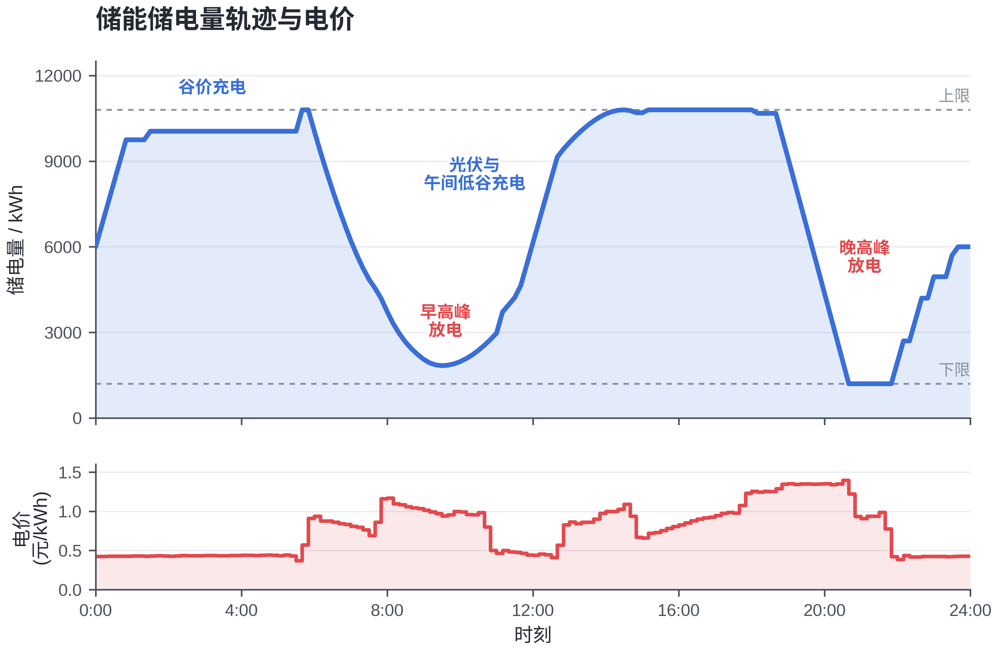

[简体中文](README.zh-CN.md) | English

# CUMCM-2026-C

Microgrid load/PV forecasting and battery scheduling, organized from a mathematical modeling competition project.

This research snapshot covers deterministic day-ahead scheduling (Q1), history-only forecasting with empirical chance constraints (Q2), four-stage PV forecast updates (Q3), and variable-price EW + Ridge forecasting (Q4). It is intended for developers exploring reproducible numerical experiments. It does not connect to a real grid or trading service.

## Demo and reference results

The credential-free synthetic demo calls the preserved Q1 solver and the shared 48-hour optimizer. Expected output:

```json
{
  "solver_status": "Optimal",
  "periods": 144,
  "total_cost_yuan": 3206.6449614242956,
  "total_grid_purchase_kwh": 8016.61240356074,
  "soc_terminal_kwh": 6000.0,
  "synthetic_48h_lp_success": true
}
```

Files: `runs/demo/demo_dispatch.xlsx`, `demo_dispatch.csv`, and `demo_summary.json`. Costs are in CNY, energy in kWh. This synthetic example is **not** a competition result.

Recorded competition outputs are in [results/reference/final](results/reference/final). The authoritative Q4 variant is the same-type 8-day EW + Ridge model, not the older lag-7 comparison baseline.

| Case | Period | Recorded total cost (CNY) |
|---|---|---:|
| Q1 | One typical day | 35,126.948589 |
| Q2 | 2025-02-01 to 2025-12-31 | 13,634,329.584094 |
| Q3 | Same 334 days | 13,149,460.948548 |
| Q4-2 | Same 334 days | 14,308,775.528818 |
| Q4-3 | Same 334 days | 13,854,618.279093 |

See [validation evidence](docs/VALIDATION.md) for what was actually rerun and the comparison tolerances. Q1 costs cannot be compared directly with a 334-day total.



## Environment and quick start

Validated locally: Windows, CPython **3.12.14**, CPU, in a new virtual environment. Other operating systems and Python versions are not claimed as validated. Git and a working Python 3.12 installation are required. No account, API key, GPU, database, or paid service is required to run the demo or models. Package installation needs internet access; model execution is offline once dependencies and resources are present.

PowerShell, from a location where you want the repository:

```powershell
git clone https://github.com/Sean-xzx/CUMCM-2026-C.git
cd CUMCM-2026-C
python -m venv .venv
.\.venv\Scripts\python.exe -m pip install -r requirements-demo.txt
.\.venv\Scripts\python.exe scripts/run.py check-sources
.\.venv\Scripts\python.exe scripts/run.py demo --out runs/demo
```

Success means `Optimal`, 144 slots, terminal SOC 6000 kWh, `synthetic_48h_lp_success: true`, and all three files above. Numerical tolerances for the demonstrated cost and terminal SOC are `1e-5` CNY and `1e-6` kWh. No official files are needed for this quick start.

For all original unit tests, notebooks, and full reproduction, install the validated full dependency lock:

```powershell
.\.venv\Scripts\python.exe -m pip install -r requirements.txt
.\.venv\Scripts\python.exe -m pip check
.\.venv\Scripts\python.exe -m pytest -q
```

`requirements.txt` pins the complete installed environment, including CPU PyTorch from its official wheel index and XGBoost. `requirements-demo.txt` pins the six direct demo dependencies, while its transitive dependencies are resolved by pip. The full lock is the environment used for recorded verification.

## Official resources and full reproduction

Official attachments and their derived input CSVs are **not redistributed**: their redistribution permission has not been established. Obtain the Problem C attachment bundle separately and preserve all files unchanged. See [resource sources, layout, and hashes](docs/RESOURCES.md). Resources are local files; the repository never downloads them automatically.

Required layout under your chosen data directory:

```text
data/official/
  附件1.xlsx
  附件2.xlsx
  附件3.xlsx
  附件4.xlsx
  附件5/
    result1.xlsx
    result2.xlsx
    result3.xlsx
    result4-2.xlsx
    result4-3.xlsx
```

```powershell
.\.venv\Scripts\python.exe scripts/run.py check-resources --data-dir data/official
.\.venv\Scripts\python.exe scripts/run.py reproduce --data-dir data/official --out runs/full
.\.venv\Scripts\python.exe scripts/run.py verify --results runs/full
```

An external directory is also supported: quote the `--data-dir` value when it contains spaces. All nine SHA-256 hashes must match [the resource manifest](data/resource-manifest.json). Missing or changed resources produce an explicit error and a nonzero exit code. Do not rename unrelated files to satisfy the manifest.

The reproduction writes five newly generated `result*.xlsx` files, per-question summaries, Q4 EW metrics, and a run summary below `runs/full`; the final command writes `reference-comparison.json`. Committed reference outputs remain untouched. Success requires matching planned/adjusted purchase values within **1e-4 kWh**. Excel ZIP bytes can differ because of metadata; byte equality is not the numerical comparison criterion.

Run selected questions with `--questions q1 q2`, or rerun Q3's 16 January parameter combinations using `--select-q3`. The default Q3 run uses the recorded frozen parameters `A0=0.6, ALO=0.7, AHI=0.9`; Q4 reruns January EW parameter selection. Full runs are materially slower than the demo; observed timing is recorded with the verification evidence rather than promised as a performance guarantee.

## Structure and data flow

```text
scripts/run.py           portable CLI and resource checks
src/q1/                 preserved deterministic solver and tests
src/q2/                 preserved forecasting/CCP library, notebook, tests
src/q3/                 preserved main four-stage notebook
src/q4/                 preserved shared engine, EW adapter, notebooks, tests
src/delivery/           preserved template filling/validation scripts
tests/                  new portability and input/output checks
results/reference/      archived metrics, figures, final workbooks
docs/                   architecture, resource and verification notes
experiments/            meaningful Q1 v2 and Q3 historical variants
data/resource-manifest.json  hashes only; no official raw data
source-manifest.json    original-to-repository mapping and SHA-256 hashes
```

Official load/PV data feed a forecast, historical error margins, an LP battery plan, and realized settlement. Q3 adds hourly **PV** forecasts issued at 0/6/12/18, interpolates them to ten-minute slots, and updates only unexecuted decisions. Q4 predicts prices from a same-type EW baseline plus a Ridge correction driven by forecast net-load changes. Predicted prices guide optimization; actual prices settle costs. The delivery functions fill and normalize output templates.

The questions share methods, but Q3 and Q4 contain independent copies of parts of the logic; they do not form a chain of direct Python imports. [Architecture and preserved-source policy](docs/ARCHITECTURE.md); [file-by-file guide](docs/FILES.md) explains the adapters. Existing core code and data/results were not edited. The CLI provides explicit paths and executes Q3's original cells in a staged work directory. Some original files still contain author-specific absolute paths; use the CLI rather than their historical default entry points.

## Tests, limitations, and development

- GitHub Actions runs source integrity checks, synthetic/demo tests, the available original unit tests, and documentation checks on a Windows/Python 3.12 runner. It does not train all four candidate prediction models or execute official-data annual runs.
- Four original tests depend on unavailable public resources or embedded author paths. They are explicitly skipped in public CI; the official reproduction/verification commands provide the corresponding execution evidence. A passed unit suite is not an annual-result reproduction claim.
- Q2's formal deployment is EW/EWMA selected using January only. Ridge/XGBoost/GRU benchmark training is separate and its full annual training is not claimed as rerun. Seeds in the preserved ML implementations are 42; stochastic results may vary by environment.
- Assumptions include one-way charging/discharging efficiency 0.9, one SOC initialization at 6000 kWh on February 1 for Q2–Q4, and 48-hour planning without a hard terminal SOC equality. These are research choices, not operational guarantees.
- The archived original paper is excluded from this release because its title and some reported percentages/Q4 tables are unfinished or inconsistent. The original method notes are historical evidence and may include editing remarks. Current commands and reference outputs take precedence.

Common failures: install the full lock if importing Q2 reports missing `torch`/`xgboost`; check resource hashes if annual reproduction fails; use Python 3.12 and the demonstrated commands rather than manually running a notebook from an arbitrary directory. Chinese plot labels may need a CJK font for original plotting routines. Numerical CLI verification does not require generating those plots.

This is a competition research snapshot, without an ongoing maintenance or support guarantee. Report reproducible problems through [Issues](https://github.com/Sean-xzx/CUMCM-2026-C/issues), including the command, Python/package versions, and sanitized traceback. Do not attach credentials or privately obtained resources. Preserve the baseline manifest when developing adapters; changes to original algorithms should be a separate, clearly identified research variant.

## License, sources, and acknowledgments

All rights reserved, as requested by the owner. No open-source license is granted. Public viewing does not grant general permission to use, modify, or redistribute the project; request permission from the rights holders for such uses. Third-party resources retain their original terms and are not re-licensed by this repository. [Resource notes](docs/RESOURCES.md) record provenance and excluded materials. The preserved source originates from the team's local CUMCM project; numerical work uses NumPy, pandas, SciPy/HiGHS, scikit-learn, and the original ML dependencies where applicable. Credit the project and the relevant original methods when describing its results.
